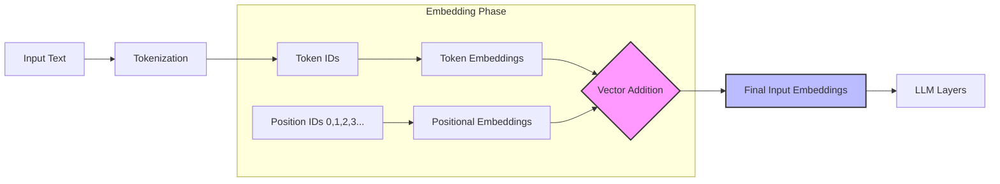

## How I understand data preprocessing

### Why we need word embeddings

Raw text cannot be directly processed by an LLM because LLM is a deep neural network model, and neural networks cannot work with categorical data. The LLM requires vector formats to perform mathematical operations during training. Therefore, raw text must be represented as continuous vectors.

This process relates to a fundamental concept in machine learning and AI called **embedding**. Embedding is the concept of transforming data into a numerical vector representation that computers can process and understand. It is worth mentioning that different data formats require distinct embedding models — text, video, and audio each have their own embedding approaches.

A vector is simply a list of numbers. For example, the word 'cat' can be represented as [0.2, -0.5, 1.3, 0.8]. The higher the dimensionality of the vector, the more information it can store. The key idea is that similar words have similar vectors. 

It is also worth mentioning that LLMs do not rely on a separate pre-built word embedding model. Instead, LLMs create their own embedding layers as part of the LLM pipeline. 

Embeddings need to be optimized for the specific task. In the context of LLMs, embeddings have a much higher dimensionality compared to traditional word embeddings, because the model needs to capture complex relationships and patterns across large amounts of text.

The required steps for preparing embeddings used by an LLM are:
- splitting text into words and converting words into tokens;
- turning tokens into embedding vectors.

### How input text is split into tokens

In this section I want to show how I understand the tokenization process works using a simple example with Python's regular expression library. It is also worth mentioning that LLMs use prebuilt tokenizers in practice — for example, tiktoken from OpenAI, which is used in GPT. Such tokenizers are already optimized, work faster, and use BPE.

Splitting text into individual tokens is a required preprocessing step for creating embeddings for an LLM. I practiced this with an example from Raschka's repository on GitHub, using the file "the-verdict.txt". First, the file contains a total of 20,479 characters, which need to be tokenized into individual words and special characters. These tokens are then converted into token IDs using a vocabulary, and later into embedding vectors that the LLM can process.

To split the text I used Python's regular expression library `re`. The splitting is performed using the `re.split` command that recognizes punctuation marks, quotation marks, and double dashes as individual tokens. This ensures that a word followed by a comma is treated as two separate entities. After splitting, I applied the strip() command to remove unnecessary whitespaces. The first 10 tokens of the resulting output are: `['I', 'HAD', 'always', 'thought', 'Jack', 'Gisburn', 'rather', 'a', 'cheap', 'genius']`.

### How tokens are converted to token IDs

Token IDs are an intermediate representation used before converting tokens into embedding vectors. Each token ID is an integer in the range `[0, vocab_size-1]`.

In a basic tokenizer, the mapping tokens to token IDs is done via a dictionary built from a training dataset. This is the simple approach. The vocabulary collects all unique tokens (words and special characters), sorts them alphabetically, and assigns each a unique integer. 

A major limitation of this approach is that it struggles with unknown words. Words that were not present in the training vocabulary. Depending on the implementation, it either raises an error or replaces the unknown word with a special '<unk>' token.

As I understand, GPT models use **Byte Pair Encoding (BPE)**, a more modern tokenization approach. I found a clear implementation of BPE in 'tiktoken', an open-source library from OpenAI. BPE is a tokenization algorithm that converts text into tokens. It can handle any words, for example, common words are converted into tokens directly, while unknown words are broken down into smaller subword and then represented as a sequence of subword tokens.

### Understanding Data Sampling for an LLM

I have learned that a tokenizer converts raw text into a list of token IDs. But how is this data actually fed into the LLM? I know that an LLM has its own embedding layer which processes input token IDs into vectors. One crucial aspect here is about next word prediction. That is why the sliding window approach is applied. But what is it?

As I understand it, the model has a limited context window — a maximum number of tokens it can process at once. Before loading data into an LLM, we collect tokens and use a sliding window approach to chunk tokens into overlapping sequences. The result of this process is the creation of two tensors: an input tensor and a target tensor. The target tensor is simply the input tensor shifted by one position.

### How token IDs are converted to embeddings

This is the final step of the input processing pipeline. Previously, I covered the workflow involving input text, tokenization, and the generation of token IDs. Now, these IDs need to be transitioned into continuous vector representations.



I have implemented this process and will explain it here. I started with a tensor of token IDs generated from the previous step. In this example, I used a batch of 8 sequences, each containing 4 tokens:

```md
tensor([[  287,   262,  6001,   286],
        [  465, 13476,    11,   339],
        [  550,  5710,   465, 12036],
        [   11,  6405,   257,  5527],
        [27075,    11,   290,  4920],
        [ 2241,   287,   257,  4489],
        [   64,   319,   262, 34686],
        [41976,    13,   357, 10915]])
```

The shape of this tensor is `torch.Size([8, 4]).

Now this representation (tensor) needs to be converted to embeddings. First, we need to define the vocabulary size and dimensions for the embeddings. I configured the parameters according to the GPT-2 standard:
- Vocabulary Size: 50,257 tokens;
- Embedding Dimension: 256.

Technically, I created an embedding layer using torch.nn.Embedding(50257, 256). This layer acts as a weight matrix with 50,257 rows and 256 columns. By applying this layer to my tensor, every token ID was replaced by its corresponding 256-dimensional vector. As a result, the output tensor now has a shape of `torch.Size([8, 4, 256])`.

This layer is then applied to the tensor of token IDs. Here is what the output looks like for the first sequence in the batch [287, 262, 6001, 286]:
```md
tensor([[ 1.1536, -0.0114,  1.9532,  ..., -0.0769, -0.1139, -0.4395],
        [-0.7573, -1.6247,  3.7293,  ...,  1.0565, -0.2383,  0.9594],
        [-1.2008,  0.4604, -0.4043,  ...,  0.9945,  0.3536,  1.0829],
        [ 0.0353,  0.8891, -1.5133,  ...,  0.4058, -0.0665, -0.0238]],
       grad_fn=<SelectBackward0>)
```
Each row here represents a 256-dimensional vector for each token. The values in the vectors can be both positive and negative.

The next problem is that for the same token ID, the vector representation is always identical, regardless of where the word appears in the text. The solution is to add positional embeddings. But what are they?

Positional embeddings are a component that provides information about the order and position of tokens in a sequence. They are important because they are essential for maintaining the meaning and structure of language. There are three types of positional embeddings: Absolute Positional Embeddings, Relative Positional Embeddings, and the most recent type — Rotary Positional Embeddings.

I practiced implementing Absolute Positional Embeddings. This approach assigns a unique vector to each position, which makes it very simple to implement. For a sequence of 4 tokens, the resulting tensor looks like this:
```md
tensor([[-0.0203, -0.5131,  0.0790,  ..., -0.2926,  1.5852, -1.3504],
        [ 0.7509,  0.5132,  1.0485,  ..., -0.0512, -1.8148,  0.8591],
        [-0.3285,  0.2146,  0.2122,  ..., -0.4332,  0.0415, -0.2015],
        [ 0.5400,  0.5376, -0.3311,  ..., -0.6633, -1.4760,  0.7115]],
       grad_fn=<EmbeddingBackward0>)
```
Tensor size: torch.Size([4, 256]). The vectors work as follows: the first row is the vector for the first position (for example, for the token at index 287), the second row is for the second position, and so on.

Finally, these positional vectors are added directly to the main token embeddings.
